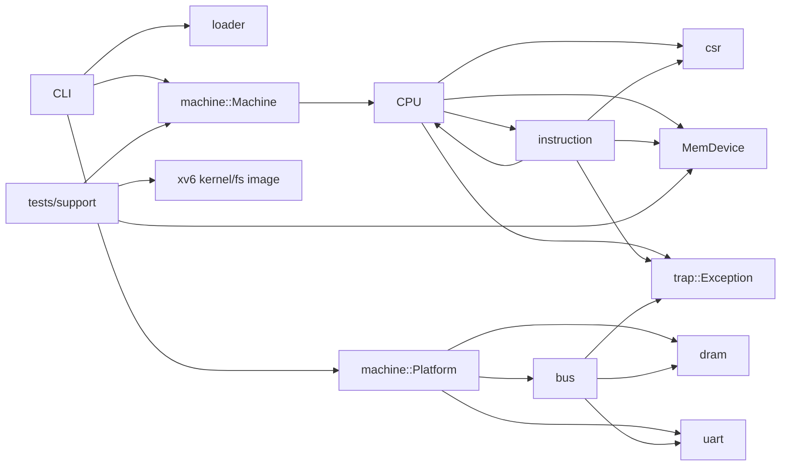

# arvsim 仓库状态总览

本文档集基于 2026-07-11 的当前工作树与提交 `008ae8b`。分析对象包括正式 crate、命令行入口、测试支撑和脚本；工作树已有未提交实现，本文描述的是实际文件状态而不是单独的 `HEAD`。`target/` 仅作为验证输入和构建产物，不作为源模块分析。

## 总体判断

arvsim 是一个无第三方 Rust 依赖、单 hart、解释执行式的 RV64 模拟器原型。库层已经具备 RV64I/M/A、部分 RVC、CSR、监督模式 trap、Sv39、定时器、外部中断接入点，以及 flat/ELF64 镜像装载；测试层另外实现了 UART、简化 PLIC 和 virtio-blk，目标是驱动特定版本的 xv6-riscv。

当前实现更接近“面向 xv6 验收的功能原型”，尚不是通用、规范一致的 RISC-V 虚拟机。CLI 已具备镜像格式、步数、调试和基础平台配置，`Platform` 也能验证并组装 DRAM/MMIO；但 `Machine` 目前仍把 reset/step/run 直接转发给 CPU，平台设备没有 tick/reset 生命周期，测试辅助和交互 runner 也会直接调用 `Cpu::step()`。正式平台仍缺少 CLINT、PLIC、virtio。xv6 快速路径现为显式启用并从 kernel ELF 解析符号地址，但仍依赖固定结构布局和用户地址；特权级、CSR、MMU、异常与原子语义也仍是简化模型。

## 状态标记

| 状态 | 含义 |
| --- | --- |
| 已实现 | 主路径有代码且默认测试覆盖核心行为 |
| 部分实现 | 可支撑当前目标，但语义、覆盖或通用性不完整 |
| 测试专用 | 只存在于 `tests/`，正式库和 CLI 无法直接使用 |
| 占位 | 模块已导出但没有实现 |

## 模块索引

| 模块 | 当前状态 | 说明 |
| --- | --- | --- |
| [仓库与 crate 边界](./architecture.md) | 部分实现 | 源码、测试平台与脚本的总体关系 |
| [`src/lib.rs`](./lib.md) | 已实现 | crate 顶层模块导出 |
| [`src/main.rs`](./main.md) | 已实现 | flat/ELF CLI、运行控制和基础平台配置 |
| [`src/cfg.rs`](./cfg.md) | 已实现 | 默认内存与 UART 布局常量 |
| [`src/trap.rs`](./trap.md) | 部分实现 | 异常枚举，不含统一 trap/interrupt 模型 |
| [`src/bus.rs`](./bus.md) | 已实现 | 区域式 MMIO 总线与设备 trait |
| [`src/dram.rs`](./dram.md) | 已实现 | 128 MiB 小端平坦内存 |
| [`src/uart.rs`](./uart.md) | 部分实现 | 仅发送和固定状态的简化 UART |
| [`src/csr.rs`](./csr.md) | 部分实现 | 数组式 CSR 与 S-mode 别名 |
| [`src/instruction.rs`](./instruction.md) | 部分实现 | RV64I/M/A、部分 RVC 和系统指令 |
| [`src/loader.rs`](./loader.md) | 已实现 | flat binary 与 ELF64 RISC-V 装载 |
| [`src/machine.rs`](./machine.md) | 部分实现 | 地址空间组装完成，运行期设备生命周期仍未建模 |
| [`src/cpu.rs`](./cpu.md) | 部分实现 | 执行循环、Sv39、trap/interrupt 与 xv6 快速路径 |
| [`src/clint.rs`](./clint.md) | 占位 | 空模块 |
| [`src/plic.rs`](./plic.md) | 占位 | 空模块 |
| [`tests/support/mod.rs`](./test-support.md) | 测试专用 | xv6 机器、PLIC、virtio、UART 和构件工具 |
| [`tests/cli.rs`](./cli-tests.md) | 已实现 | CLI 帮助、正常停止和错误退出进程测试 |
| [`tests/rv64i_smoke.rs`](./rv64i-smoke.md) | 已实现 | 3 个默认执行的基础 CPU/UART 合同 |
| [`tests/xv6_fixture.rs`](./xv6-fixture.md) | 测试专用 | xv6 启动和用户态验收合同 |
| [`scripts/`](./scripts.md) | 部分实现 | xv6 构建、测试编排和临时交互启动 |

## 关键耦合

`instruction` 直接修改 `Cpu` 公共字段，形成双向强耦合；CPU 通过 `MemDevice` 与具体地址空间解耦，中断也通过同一 trait 查询。CLI 使用正式 `Platform/Bus`，xv6 测试则把完整测试设备实现成单个 `TestBus`。二者都持有 `Machine`，但连续运行和测试 helper 最终仍由 CPU 自己推进时钟和查询中断。因此“测试中能运行 xv6”不等于“正式库已提供 xv6 平台”，也不代表机器级设备生命周期已经统一。

## 验证快照

- `cargo test --all-targets`：通过；共 30 个默认执行测试通过，4 个 xv6 测试被忽略。
- RV64 内存/分支/x0 合同使用 signature + `ebreak` 明确结束，已纳入默认测试并通过。
- `cargo fmt --all -- --check`、`cargo clippy --all-targets -- -D warnings`、doc tests 和脚本语法检查通过。
- 本轮未重跑耗时很长的 4 个 xv6 ignored 合同；它们依赖外部工具链、fixture 和较大执行预算。

详见 [验证记录](./verification.md) 与 [不完善之处和优化方向](./gaps-and-roadmap.md)。
