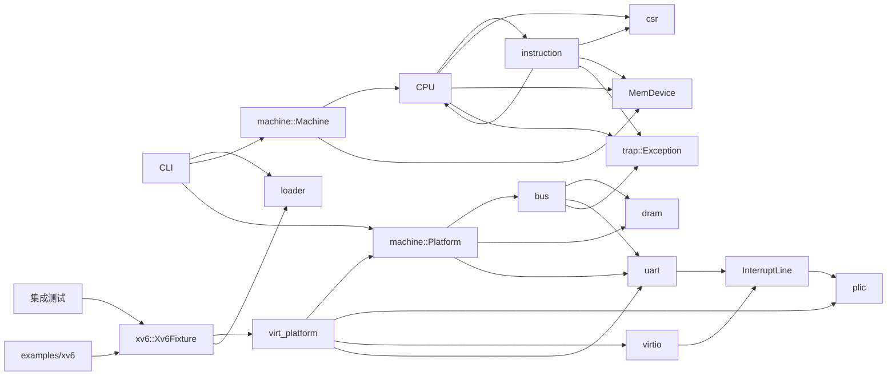

# arvsim 仓库现状总览

本文介绍 2026-09-05 的实现情况，包括基线提交 `849ace2` 之后完成的本轮修复。范围涵盖库、命令行、示例、测试和脚本；`target/` 保存外部源码、测试输入和构建文件，不计入项目源码。

## 当前功能

arvsim 是一个用 Rust 编写的 RISC-V RV64 解释器，只模拟一个硬件线程（hart），不依赖第三方 Rust 库。它支持 RV64I/M/A、部分 RVC 指令，以及用户模式（U）、监督模式（S）和机器模式（M）。

CPU 已实现控制与状态寄存器（CSR）、异常与中断委托、物理内存保护（PMP）、Sv39 分页和 Sstc 监督模式定时器。平台提供 UART、PLIC 和 Virtio 块设备，并支持加载原始二进制和 ELF64 镜像。xv6 镜像检查和启动也由库完成，测试只负责准备输入和检查结果。

本轮修复了 PLIC 中断处理、无效 CSR 地址、ELF 入口转换、DMA 写入后的 LR/SC 保留检查，以及 Virtio 描述符处理等问题，并删除跳过用户态 `exec` 的特殊处理。页表常量、内存范围检查和 xv6 启动代码已统一使用。各模块文档说明具体行为和规范依据，实际测试结果见 [验证记录](./verification.md)。

当前主要用于运行和测试 xv6，尚未完成对整个 RISC-V 指令集和设备规范的验证。平台缺少 CLINT/ACLINT，Virtio 只支持同步单队列块设备，UART 和 RVC 也只实现部分功能。可选的 xv6 内核加速依赖固定版本，会合并处理多条指令；用户模式下的指令始终逐条执行，也可以关闭全部加速。

## 状态说明

| 状态 | 含义 |
| --- | --- |
| 已实现 | 主要功能已完成，并有默认测试 |
| 部分实现 | 已能满足当前用途，但功能、测试覆盖或适用范围仍有限 |
| 测试专用 | 只用于测试，不属于库或命令行程序的公开接口 |
| 占位 | 只有模块声明，尚无功能实现 |

## 模块索引

| 模块 | 实现状态 | 说明 |
| --- | --- | --- |
| [目录结构与模块分工](./architecture.md) | 部分实现 | 库、示例、测试和脚本分别负责什么 |
| [`src/lib.rs`](./lib.md) | 已实现 | 库公开的模块 |
| [`src/main.rs`](./main.md) | 已实现 | 镜像加载、运行参数和基本平台配置 |
| [`src/cfg.rs`](./cfg.md) | 已实现 | 默认内存和设备地址配置 |
| [`src/trap.rs`](./trap.md) | 已实现 | 异常原因、中断原因和中断位集合 |
| [`src/bus.rs`](./bus.md) | 已实现 | 根据地址访问内存和 MMIO 设备 |
| [`src/dram.rs`](./dram.md) | 已实现 | 小端内存、范围检查和页写入版本号 |
| [`src/interrupt.rs`](./interrupt.md) | 已实现 | 设备与中断控制器共用的电平信号 |
| [`src/uart.rs`](./uart.md) | 部分实现 | 支持替换输入输出实现的 16550 串口 |
| [`src/plic.rs`](./plic.md) | 部分实现 | 可配置的电平中断控制器 |
| [`src/virtio.rs`](./virtio.md) | 部分实现 | Virtio 1.2 MMIO 单队列块设备 |
| [`src/virt_platform.rs`](./virt-platform.md) | 已实现 | 创建单硬件线程的 QEMU `virt` 风格平台 |
| [`src/csr.rs`](./csr.md) | 部分实现 | CSR 状态、别名和写入限制 |
| [`src/instruction.rs`](./instruction.md) | 部分实现 | RV64I/M/A、部分 RVC 和系统指令 |
| [`src/loader.rs`](./loader.md) | 部分实现 | 原始二进制与 ELF64 加载、入口转换和写入前检查 |
| [`src/machine.rs`](./machine.md) | 已实现 | 创建地址空间，统一复位和运行 CPU 与设备 |
| [`src/cpu.rs`](./cpu.md) | 部分实现 | 特权级、PMP、Sv39、异常、中断和 xv6 加速 |
| [`src/xv6.rs` 与 `examples/xv6.rs`](./xv6-fixture.md) | 已实现 | xv6 镜像检查、平台创建和交互运行 |
| [`src/clint.rs`](./clint.md) | 占位 | 尚未实现的 CLINT 模块 |
| [测试分工与编写原则](./test-support.md) | 测试专用 | 根据功能需求检查结果 |
| [`tests/cli.rs`](./cli-tests.md) | 已实现 | 启动命令行进程，检查帮助、运行和退出状态 |
| [`tests/rv64i_smoke.rs`](./rv64i-smoke.md) | 已实现 | RV64 程序执行和整机复位 |
| [`tests/xv6_fixture.rs`](./xv6-fixture.md) | 测试专用 | xv6 启动和用户程序测试 |
| [`scripts/`](./scripts.md) | 部分实现 | 构建固定版本的 xv6、运行测试和交互示例 |

## 主要依赖关系

CPU 调用 `instruction` 执行指令，指令模块也会修改 CPU 状态。CPU 通过 `MemDevice` 访问内存和设备、获取中断集合；`Machine` 通过同一接口复位设备和更新时钟。

UART 与 Virtio 通过共享中断线发送信号。PLIC 记录待处理中断、选择优先级，并向 CPU 报告机器模式或监督模式外部中断。xv6 测试和交互示例共同使用 `Xv6Fixture`，不再各自解析内核符号或创建另一套运行环境。

## 测试结果

默认测试覆盖 CPU、指令、内存、设备、镜像加载、主命令行和示例参数。xv6 测试分别记录开启与关闭内核加速的结果。实际命令、测试数量和耗时见 [验证记录](./verification.md)；尚未实现的功能和需要补充的测试见 [后续计划](./gaps-and-roadmap.md)。
