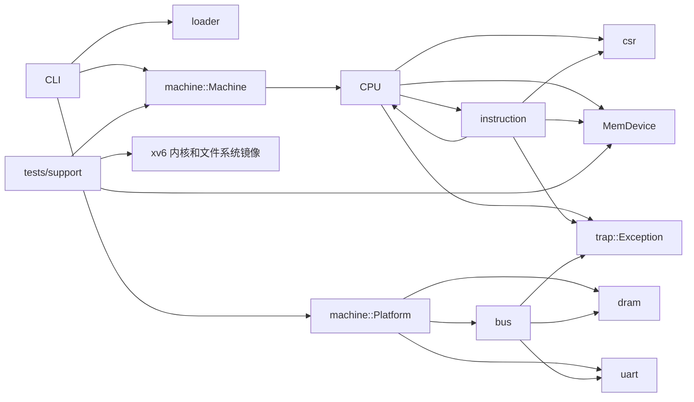

# arvsim 仓库状态总览

本文档基于 2026-07-12 的提交 `822629c` 和截至 2026-07-13 的工作区代码，涵盖库、命令行程序、测试代码和脚本。`target/` 只作为测试输入和构建产物，不计入源码分析。

## 总体判断

arvsim 是一个不依赖第三方 Rust 库的单硬件线程 RV64 解释器原型。库中已有 RV64I/M/A、部分 RVC、U/S/M 特权级、CSR、异常与中断委托、PMP、Sv39、Sstc 定时器、外部中断接口，以及裸二进制和 ELF64 镜像装载。测试代码还实现了 UART、简化 PLIC 和 virtio-blk，用于运行特定版本的 xv6-riscv。

当前版本主要用于验证 xv6，还不是通用且完整符合规范的 RISC-V 虚拟机。命令行程序支持镜像格式、步数限制、调试输出和基础平台配置；`Platform` 可以检查并组装 DRAM 与内存映射 I/O（MMIO）。`Machine` 目前只是 CPU 的简单封装，平台设备没有统一的时钟推进和复位接口，部分测试代码也会直接调用 `Cpu::step()`。库中的平台仍缺少 CLINT、PLIC 和 virtio。xv6 加速功能会从内核 ELF 中读取符号地址，但仍依赖固定的数据结构布局和用户程序地址。原子保留、访问对齐、完整 RVC 取指、TLB/ASID 和部分设备语义尚未实现。

## 状态标记

| 状态 | 含义 |
| --- | --- |
| 已实现 | 主要功能已有实现，并有默认测试覆盖 |
| 部分实现 | 可以满足当前用途，但规范语义、测试或通用性仍不完整 |
| 测试专用 | 只存在于 `tests/`，库和命令行程序无法直接使用 |
| 占位 | 模块已导出但没有实现 |

## 模块索引

| 模块 | 实现状态 | 说明 |
| --- | --- | --- |
| [仓库结构与代码组成](./architecture.md) | 部分实现 | 源码、测试平台与脚本之间的关系 |
| [`src/lib.rs`](./lib.md) | 已实现 | 库的顶层模块导出 |
| [`src/main.rs`](./main.md) | 已实现 | 裸二进制/ELF64 镜像装载、运行控制和基础平台配置 |
| [`src/cfg.rs`](./cfg.md) | 已实现 | 默认内存与 UART 布局常量 |
| [`src/trap.rs`](./trap.md) | 已实现 | 同步异常枚举、原因码和附加值 |
| [`src/bus.rs`](./bus.md) | 已实现 | 区域式 MMIO 总线与设备接口 |
| [`src/dram.rs`](./dram.md) | 已实现 | 128 MiB 小端平坦内存 |
| [`src/uart.rs`](./uart.md) | 部分实现 | 仅发送和固定状态的简化 UART |
| [`src/csr.rs`](./csr.md) | 部分实现 | 已实现所需 CSR、监督模式别名、权限辅助和字段约束 |
| [`src/instruction.rs`](./instruction.md) | 部分实现 | RV64I/M/A、部分 RVC 和系统指令 |
| [`src/loader.rs`](./loader.md) | 已实现 | 裸二进制与 ELF64 RISC-V 镜像装载 |
| [`src/machine.rs`](./machine.md) | 部分实现 | 可组装地址空间，尚不能统一推进和复位设备 |
| [`src/cpu.rs`](./cpu.md) | 部分实现 | U/S/M、PMP、Sv39、异常/中断和 xv6 加速 |
| [`src/clint.rs`](./clint.md) | 占位 | 空模块 |
| [`src/plic.rs`](./plic.md) | 占位 | 空模块 |
| [`tests/support/mod.rs`](./test-support.md) | 测试专用 | xv6 机器、PLIC、virtio、UART 和测试文件工具 |
| [`tests/cli.rs`](./cli-tests.md) | 已实现 | 命令行帮助、正常停止和错误退出进程测试 |
| [`tests/rv64i_smoke.rs`](./rv64i-smoke.md) | 已实现 | 3 个默认执行的基础 CPU/UART 测试 |
| [`tests/xv6_fixture.rs`](./xv6-fixture.md) | 测试专用 | xv6 启动和用户态验收测试 |
| [`scripts/`](./scripts.md) | 部分实现 | xv6 构建、测试编排和临时交互启动 |

## 主要依赖关系

`instruction` 会直接修改 `Cpu`，CPU 又会调用 `instruction`，两者相互依赖。CPU 通过 `MemDevice` 访问内存和设备，并通过同一接口查询中断。命令行程序使用库中的 `Platform/Bus`，xv6 测试则把所有测试设备放在一个 `TestBus` 中。两者都包含 `Machine`，但实际运行仍由 CPU 自己推进时钟和查询中断。因此，测试可以运行 xv6，并不表示库中已经提供完整的 xv6 平台，也不表示设备的运行和复位已经由 `Machine` 统一管理。

## 验证快照

- `cargo test --all-targets`：51 个测试通过，4 个 xv6 测试未执行。
- 默认测试已覆盖 U/S/M 异常与中断路由、委托与返回、CSR 权限、PMP、Sv39 权限和 Sstc 待处理状态。
- `cargo fmt --all -- --check`、`cargo clippy --all-targets -- -D warnings`、文档测试和文档构建均通过。
- xv6 可启动到 shell；基础用户程序和快速 usertests 通过。完整 usertests 本次未运行。

详见 [验证记录](./verification.md) 与 [后续计划](./gaps-and-roadmap.md)。
