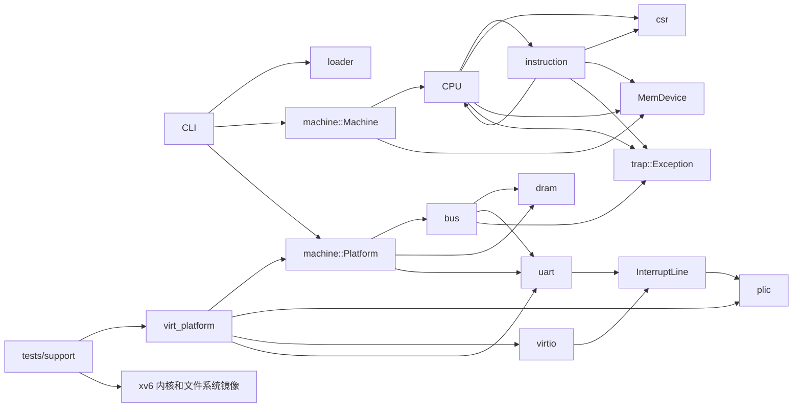

# arvsim 仓库状态总览

本文档已同步到 2026-08-12 的当前工作区代码（`main` 分支基线提交 `17ad107`，并包含尚未提交的实现与文档变更），涵盖库、命令行程序、测试代码和脚本。`target/` 只作为测试输入和构建产物，不计入源码分析。

## 总体判断

arvsim 是一个不依赖第三方 Rust 库的单硬件线程 RV64 解释器原型。库中已有 RV64I/M/A、部分 RVC、U/S/M 特权级、CSR、异常与中断委托、PMP、Sv39、Sstc 定时器、外部中断接口，以及裸二进制和 ELF64 镜像装载。16550 UART、RISC-V PLIC、Virtio 1.2 MMIO 块设备及其单 hart `virt` 平台组装器现已位于正式库中；测试只保留镜像、符号和断言辅助代码。2026-07-26 审查报告中的 2 个高危、13 个中危和 50 个低危问题已整改；2026-08-12 复审新确认 11 条活动发现（高危 0、中危 6、低危 5），见 [`code-review/README.md`](../../code-review/README.md)。

当前版本主要用于验证 xv6，还不是通用且完整符合规范的 RISC-V 虚拟机。命令行程序支持镜像格式、步数限制、调试输出和基础平台配置；库调用方还可用 `VirtPlatform` 组装共享 DRAM、UART、PLIC 和 virtio-blk。`Machine` 已统一 CPU 与设备的复位、固定周期推进、单步和连续运行。平台仍缺少 CLINT/ACLINT，Virtio 只实现块设备所需的单个 split queue，UART 也只覆盖现有工作负载需要的 16550 子集。xv6 加速功能会从内核和 usertests ELF 中读取符号地址，但仍依赖固定的数据结构布局。aq/rl、多硬件线程内存顺序、完整 RVC、TLB/ASID 和部分设备语义尚未实现。

## 状态标记

| 状态 | 含义 |
| --- | --- |
| 已实现 | 主要功能已有实现，并有默认测试覆盖 |
| 部分实现 | 可以满足当前用途，但规范语义、测试或通用性仍不完整 |
| 测试专用 | 只存在于 `tests/`，不属于库或命令行程序的正式接口 |
| 占位 | 模块已导出但没有实现 |

## 模块索引

| 模块 | 实现状态 | 说明 |
| --- | --- | --- |
| [仓库结构与代码组成](./architecture.md) | 部分实现 | 源码、测试平台与脚本之间的关系 |
| [`src/lib.rs`](./lib.md) | 已实现 | 库的顶层模块导出 |
| [`src/main.rs`](./main.md) | 已实现 | 裸二进制/ELF64 镜像装载、运行控制和基础平台配置 |
| [`src/cfg.rs`](./cfg.md) | 已实现 | 默认 DRAM 与 `virt` 平台布局常量 |
| [`src/trap.rs`](./trap.md) | 已实现 | 同步异常、中断原因与待处理中断集合 |
| [`src/bus.rs`](./bus.md) | 已实现 | 区域式 MMIO 总线与设备接口 |
| [`src/dram.rs`](./dram.md) | 已实现 | 128 MiB 小端平坦内存 |
| [`src/interrupt.rs`](./interrupt.md) | 已实现 | 设备与中断控制器之间的共享电平线 |
| [`src/uart.rs`](./uart.md) | 部分实现 | 可注入后端、收发状态和中断的 16550 UART |
| [`src/plic.rs`](./plic.md) | 部分实现 | 可配置源、上下文和 MMIO 布局的 RISC-V PLIC；claim/complete 尚有规范偏差 |
| [`src/virtio.rs`](./virtio.md) | 部分实现 | Virtio 1.2 MMIO 单队列块设备 |
| [`src/virt_platform.rs`](./virt-platform.md) | 已实现 | 单 hart QEMU `virt` 风格正式平台组装器 |
| [`src/csr.rs`](./csr.md) | 部分实现 | 已实现所需 CSR、监督模式别名、权限辅助和字段约束 |
| [`src/instruction.rs`](./instruction.md) | 部分实现 | RV64I/M/A、部分 RVC 和系统指令 |
| [`src/loader.rs`](./loader.md) | 部分实现 | 裸二进制与 ELF64 RISC-V 镜像装载；非恒等 ELF 入口尚未转换 |
| [`src/machine.rs`](./machine.md) | 已实现 | 校验并组装地址空间，统一推进和复位 CPU 与设备 |
| [`src/cpu.rs`](./cpu.md) | 部分实现 | U/S/M、PMP、Sv39、异常/中断和 xv6 加速 |
| [`src/clint.rs`](./clint.md) | 占位 | 空模块 |
| [`tests/support/mod.rs`](./test-support.md) | 测试专用 | 正式平台的测试包装、xv6 镜像与符号工具 |
| [`tests/cli.rs`](./cli-tests.md) | 已实现 | 命令行帮助、正常停止和错误退出进程测试 |
| [`tests/rv64i_smoke.rs`](./rv64i-smoke.md) | 已实现 | 6 个默认执行的机器、CPU、总线、UART 和 virtio 测试 |
| [`tests/xv6_fixture.rs`](./xv6-fixture.md) | 测试专用 | xv6 启动和用户态验收测试 |
| [`scripts/`](./scripts.md) | 部分实现 | xv6 构建、测试编排和临时交互启动 |

## 主要依赖关系

`instruction` 会直接修改 `Cpu`，CPU 又会调用 `instruction`，两者相互依赖。CPU 通过 `MemDevice` 访问内存和设备，并从同一接口取得 `InterruptSet`；`Machine` 通过该接口复位和推进设备。UART 与 virtio 只驱动共享电平线，PLIC 负责锁存、仲裁并转换成 M/S 外部中断。xv6 测试和临时交互程序都使用正式 `VirtPlatform`，不再维护测试专用地址空间或修改 xv6 私有设备状态。

## 验证快照

- `cargo test --all-targets`：85 个测试通过，4 个 xv6 测试未执行。
- 默认测试已覆盖 U/S/M 异常与中断路由、CSR 权限、PMP、Sv39、Sstc、访存对齐、LR/SC、访问宽度和按长度取指。
- `cargo fmt --all -- --check`、`cargo clippy --all-targets -- -D warnings`、文档测试和文档构建均通过。
- 正式设备路径下 xv6 已有启动到 shell、基础用户程序、快速和完整 usertests 的通过记录；本次文档复审未重跑耗时长测。

详见 [验证记录](./verification.md) 与 [后续计划](./gaps-and-roadmap.md)。
