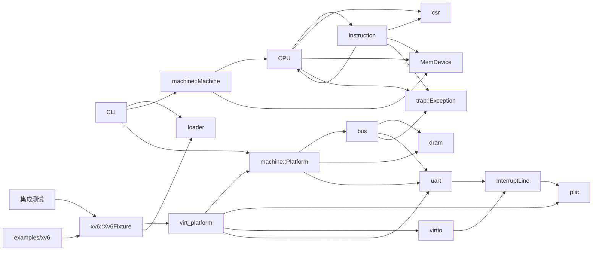

# arvsim 仓库状态总览

文档记录 2026-09-05 在基线提交 `849ace2` 之上完成的本轮修复。范围包括正式库、命令行、示例、测试和脚本；`target/` 只作为外部源码、测试输入和构建产物。

## 总体判断

arvsim 是一个不依赖第三方 Rust 库的单硬件线程 RV64 解释器。已实现 RV64I/M/A、部分 RVC、U/S/M 特权级、CSR、异常与中断委托、PMP、Sv39 和 Sstc，并提供裸二进制与 ELF64 装载。UART、PLIC、Virtio 块设备及 `virt` 平台均位于正式库；xv6 镜像验证与启动也由库实现，测试只准备输入和断言结果。

本轮已处理上轮 11 项发现，并修复 DMA 写入未使 LR/SC 保留失效、Virtio 消息边界受描述符限制，以及用户态 `exec` 被提前返回的问题。公共常量、内存范围检查和 xv6 启动逻辑已集中复用。问题与修复依据见 [审查记录](../../code-review/README.md)。

当前主要用于 xv6 验证，尚未完成通用 RISC-V 符合性验证。`Machine` 统一 CPU 与设备的复位、单步和运行；平台仍缺少 CLINT/ACLINT，Virtio 只有同步单队列块设备，UART 和 RVC 也只覆盖部分能力。可选 xv6 内核加速依赖固定版本并合并多条指令；用户态始终执行原始指令，全部加速均可关闭。

## 状态标记

| 状态 | 含义 |
| --- | --- |
| 已实现 | 主要功能已有实现，并有默认测试覆盖 |
| 部分实现 | 可以满足当前用途，但规范语义、测试或通用性仍不完整 |
| 测试专用 | 只存在于 `tests/`，不属于库或命令行程序的正式接口 |
| 占位 | 模块已导出但没有实现 |

## 模块索引

| 模块 | 实现状态 | 说明 |
| --- | --- | --- |
| [仓库结构与代码组成](./architecture.md) | 部分实现 | 正式库、示例、测试与脚本的职责 |
| [`src/lib.rs`](./lib.md) | 已实现 | 库的顶层模块导出 |
| [`src/main.rs`](./main.md) | 已实现 | 裸二进制/ELF64 镜像装载、运行控制和基础平台配置 |
| [`src/cfg.rs`](./cfg.md) | 已实现 | 默认 DRAM 与 `virt` 平台布局常量 |
| [`src/trap.rs`](./trap.md) | 已实现 | 同步异常、中断原因与待处理中断集合 |
| [`src/bus.rs`](./bus.md) | 已实现 | 区域式 MMIO 总线与设备接口 |
| [`src/dram.rs`](./dram.md) | 已实现 | 可配置小端内存、统一范围检查和页保留版本 |
| [`src/interrupt.rs`](./interrupt.md) | 已实现 | 设备与中断控制器之间的共享电平线 |
| [`src/uart.rs`](./uart.md) | 部分实现 | 可注入后端、收发状态和中断的 16550 UART |
| [`src/plic.rs`](./plic.md) | 部分实现 | 可配置源、上下文和 MMIO 布局的电平 PLIC |
| [`src/virtio.rs`](./virtio.md) | 部分实现 | Virtio 1.2 MMIO 单队列块设备 |
| [`src/virt_platform.rs`](./virt-platform.md) | 已实现 | 单 hart QEMU `virt` 风格正式平台组装器 |
| [`src/csr.rs`](./csr.md) | 部分实现 | 已实现所需 CSR、监督模式别名、权限辅助和字段约束 |
| [`src/instruction.rs`](./instruction.md) | 部分实现 | RV64I/M/A、部分 RVC 和系统指令 |
| [`src/loader.rs`](./loader.md) | 部分实现 | 裸二进制与 ELF64 装载、入口转换和失败前预检查 |
| [`src/machine.rs`](./machine.md) | 已实现 | 校验并组装地址空间，统一推进和复位 CPU 与设备 |
| [`src/cpu.rs`](./cpu.md) | 部分实现 | U/S/M、PMP、Sv39、异常/中断和 xv6 加速 |
| [`src/xv6.rs` 与 `examples/xv6.rs`](./xv6-fixture.md) | 已实现 | xv6 镜像验证、平台组装和交互运行 |
| [`src/clint.rs`](./clint.md) | 占位 | 空模块 |
| [测试组织](./test-support.md) | 测试专用 | 按功能分层，直接调用正式入口 |
| [`tests/cli.rs`](./cli-tests.md) | 已实现 | 命令行帮助、正常停止和错误退出进程测试 |
| [`tests/rv64i_smoke.rs`](./rv64i-smoke.md) | 已实现 | 实际 RV64 程序执行与整机复位两个用例 |
| [`tests/xv6_fixture.rs`](./xv6-fixture.md) | 测试专用 | xv6 启动和用户态验收测试 |
| [`scripts/`](./scripts.md) | 部分实现 | 固定版本构建、测试编排和 Cargo 示例启动 |

## 主要依赖关系

`instruction` 会直接修改 `Cpu`，CPU 又会调用 `instruction`，两者相互依赖。CPU 通过 `MemDevice` 访问内存和设备，并从同一接口取得 `InterruptSet`；`Machine` 通过该接口复位和推进设备。UART 与 virtio 只驱动共享电平线，PLIC 负责锁存、仲裁并转换成 M/S 外部中断。xv6 测试和交互示例共同调用 `Xv6Fixture`，不再解析符号或维护测试专用运行环境。

## 验证

默认测试涵盖 CPU、指令、内存、设备、镜像装载、主命令行和示例参数。xv6 验收分别记录内核加速模式和关闭加速的结果。实际测试数量、命令与耗时见 [验证记录](./verification.md)；尚未完成的能力见 [后续计划](./gaps-and-roadmap.md)。
